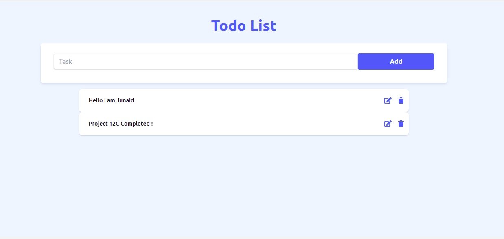
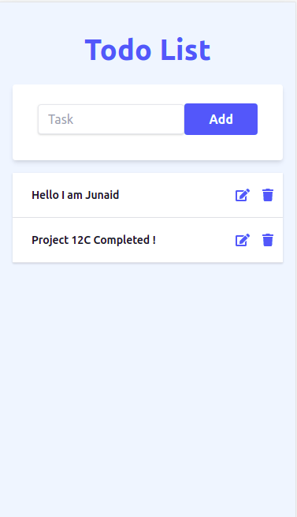

# JAMStack Todo List

### _Todo list Application using Serverless JAM Stack (Gatsby, GraphQL, FaunaDB, Serverless Functions) !!_

### Video :link: https://youtu.be/5lHbViMzMkc

### Link :link: https://todo-list-serverless.netlify.app/

## Desktop

## Mobile

## Run Locally

- Run this command `git clone https://github.com/developer-junaid/Jamstack-Todolist.git`
- You are now in the dev environment and you can play around

## Tech Stack

- HTML
- CSS
- Tailwindcss
- GraphQl
- GatsbyJs
- FaunaDB
- Netlify Serverless Functions
- Formik
